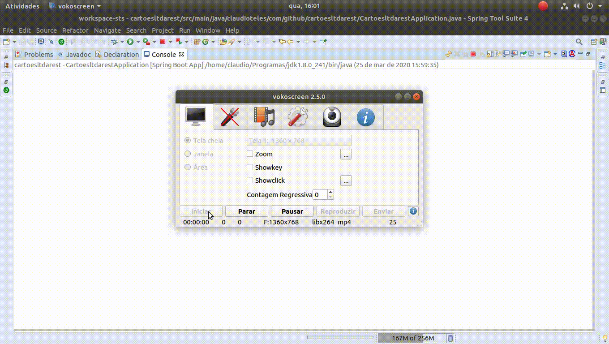
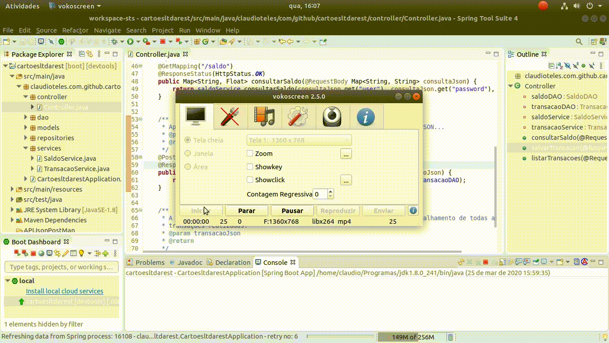
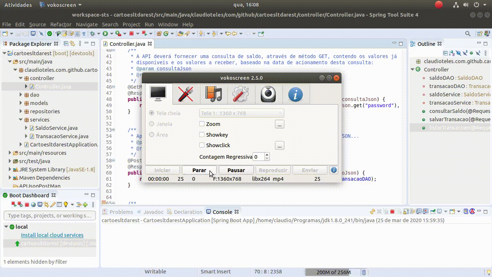
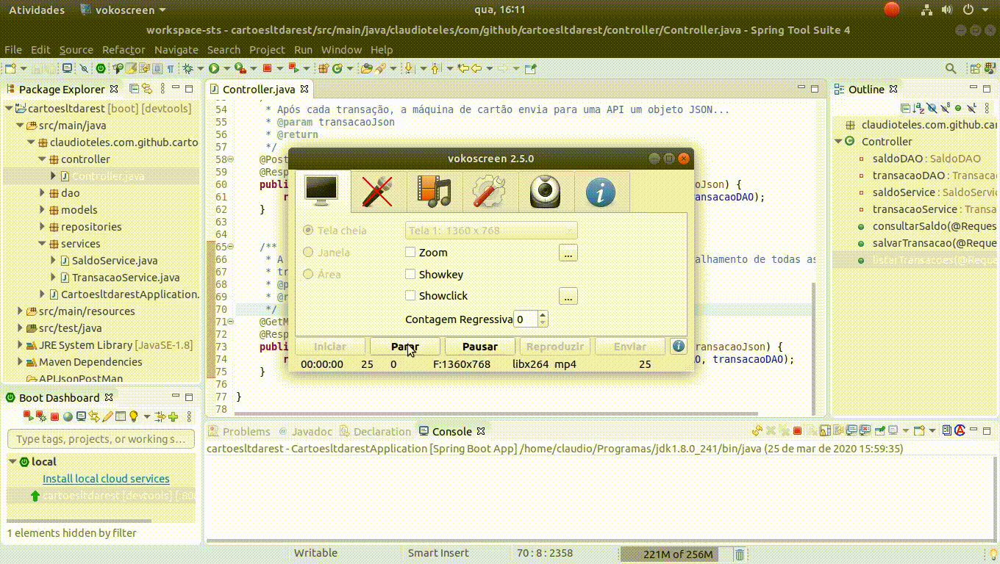

# cartoesltdarest
Servidor Rest para maquina de crédito e débito.

# Importe a API json para fazer as requisições para o servidor que está na pasta: APIJsonPosMan que
# tem o nome de: CartoesLTDARest.postman_collection.json

# Localização exata: /cartoesltdarest/APIJsonPostMan/CartoesLTDARest.postman_collection.json

# Inicializar o projeto STS

 

 

# URL Root

# Consultar saldo inicial

 

# Obter transações

 

# Postar transações

 

# Ver várias transações

 

